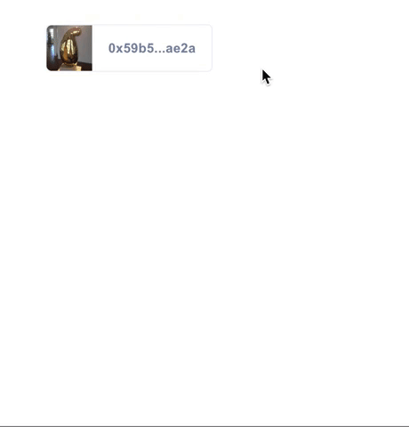

# ⚠️ ⚠️ This project is no longer supported ⚠️ ⚠️ 
> 3box.js and related tools built by 3Box Labs are deprecated and no loger supported. Developers are encurraged to build with https://ceramic.network which is a more secure and decentralized protocol for sovereign data.

# Profile Hover

`profile-hover` is a drop-in component that displays profile metadata for any ethereum address. Available in React and HTML/CSS versions.




## Component Overview
The Profile Hover consists of two components: the `Tile`, which is displayed on the page, and the `Hover`, which is displayed when the Tile is hovered. Profile Hover is available for React and HTML/CSS apps.

## Getting Started

### React Component
Installation:

```shell
npm i -S profile-hover
```

Usage:

```jsx
import ProfileHover from 'profile-hover';

const MyComponent = () => (<ProfileHover address={'0xa8ee0babe72cd9a80ae45dd74cd3eae7a82fd5d1'} />);
```

### HTML Element

First add the script at the end of your page.

```html
  <script type="text/javascript" src="https://unpkg.com/profile-hover"></script>
```

Then add the following tag where ever you display an address.

```html
  <threebox-address data-address='0xa8ee0babe72cd9a80ae45dd74cd3eae7a82fd5d1'></threebox-address>
```

Additional Options:

Add `data-display='full'` to show the entire address instead of the shorten display.

```html
  <threebox-address data-address='0xa8ee0...' data-display='full'></threebox-address>
```

Add `data-theme='none'` to not use any of our address bar styling. Allows you to wrap any existing elements in an address hover.

```html
  <threebox-address data-address='0xa8ee0...' data-theme='none'>
    ... your own html and styling
  </threebox-address>
```

## How to Customize
Here are the ways you can customize the profile hover to better suit your app's needs.

### Prop Types

| Property | Type          | Default  | Component    | Description |
| :-------------------------------- | :-------------------------------------------------------- | :------------------------------------------------------------------------------------------------------------- | :------------------------------------------------------ | :--------------------------------------------------------------------------------------------------------------------------------------------------------------------------------------------------------------------------------------------------------------------------------------------------------------------------------------------------------------------------------------------------------------- |
| `address`    | String        |    |     | `Address` property value is **required** to work.  Provide an Ethereum address to this property to fetch profile information. |
| `showName`    | Boolean       | False  | Tile    | Provide property `showName` to show the user's name from their 3Box profile instead of their Ethereum address.|
| `url`    | String       |   | Tile    | Provide property `url` with url string to set where clicking on the Tile will redirect the user.|
| `displayFull`    | Boolean        | False   | Tile    | Add `displayFull` property to show the entire address instead of the shortened display.|
| `tileStyle`    | Boolean       |  False   | Tile    | Add `tileStyle` property to render the tile component as a tile.                                                                                                                                                                                                                                                                                                             |
| `noTheme`    | Boolean       |  False   | Tile    | Add `noTheme` property to not use any of our Tile styling. Allows you to wrap any existing elements in a Hover component.                                                                                                                                                                                                                                                                                                             |
| `noImgs`    | Boolean        | False   | Hover    | Add `noImgs` property to prevent displaying of profile image and cover image in the Hover.                                                                                                                    |
| `noProfileImg`    | Boolean       |  False   | Hover    | Add `noProfileImg` property to prevent displaying of just the profile image in the Hover. |
| `noCoverImg`    | Boolean       |  False   | Hover    | Add `noCoverImg` property to prevent displaying of just the cover image in the Hover. |
| `orientation`    | String       |  `'right'`   | Hover    | Provide property `orientation` with string `'top'`, `'bottom'`, `'right'` or `'left'` to set which way the Hover will pop up from the Tile.|

#### Prop Types example
```jsx
<ProfileHover 
  address={'0xa8ee0...'}
  orientation="bottom"
  noCoverImg
  url="https://3box.io/"
/>
```
```jsx
<ProfileHover 
  address={'0xa8ee0...'} 
  noTheme
>
  ... your own html and styling
</ProfileHover>
```

## Differences Between Desktop and Mobile
Given the current state of Web3 mobile dapp browsers and their lack of browser tab support, the behavior of the profile-hover React component has minor differences depending on device context. On desktop web and web2 mobile browsers, out-bound links within the hover element work as usual and open a new tab. However on Web3 mobile dapp browsers, since tabs do not exist, clicking on a link within the hover component will, instead, copy that URL to a users clipboard.

## Maintainers
[@zachferland](https://github.com/zachferland)
